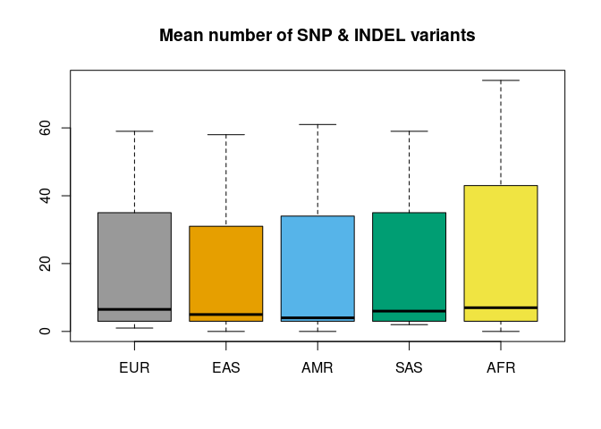
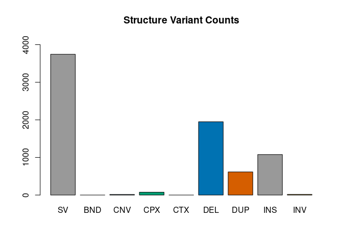

<!-- README.md is generated from README.Rmd. Please edit that file -->

# vcfppR: rapid manipulation of the VCF/BCF file

<!-- badges: start -->

<a href="https://github.com/Zilong-Li/random/blob/main/vcfppR.png"></a>

[](https://CRAN.R-project.org/package=vcfppR)

[](https://app.codecov.io/github/Zilong-Li/vcfppR)
[](https://CRAN.R-project.org/package=vcfppR)
<!-- badges: end -->

The vcfppR package implements various powerful functions for fast
genomics analyses with VCF/BCF files using the C++ API of
[vcfpp.h](https://github.com/Zilong-Li/vcfpp).

  - Load/save content of VCF/BCF into R objects with highly customizable
    options
  - Visualize and chracterize variants
  - Compare two VCF/BCF files and report various statistics
  - Streaming read/write VCF/BCF files with fine control of everything
  - [Paper](https://doi.org/10.1093/bioinformatics/btae049) shows vcfppR
    is \~20x faster than `vcfR`

## Installation

``` r
## install.package("vcfppR") ## from CRAN
remotes::install_github("Zilong-Li/vcfppR") ## from latest github
```

## Cite the work

If you find it useful, please cite the
[paper](https://doi.org/10.1093/bioinformatics/btae049)

``` r
library(vcfppR)
citation("vcfppR")
```

## URL as filename

All functions in vcfppR support URL as filename of VCF/BCF files.

``` r
phasedvcf <- "https://ftp.1000genomes.ebi.ac.uk/vol1/ftp/data_collections/1000G_2504_high_coverage/working/20220422_3202_phased_SNV_INDEL_SV/1kGP_high_coverage_Illumina.chr21.filtered.SNV_INDEL_SV_phased_panel.vcf.gz"
rawvcf <- "https://ftp.1000genomes.ebi.ac.uk/vol1/ftp/data_collections/1000G_2504_high_coverage/working/20201028_3202_raw_GT_with_annot/20201028_CCDG_14151_B01_GRM_WGS_2020-08-05_chr21.recalibrated_variants.vcf.gz"
svfile <- "https://ftp.1000genomes.ebi.ac.uk/vol1/ftp/data_collections/1000G_2504_high_coverage/working/20210124.SV_Illumina_Integration/1KGP_3202.gatksv_svtools_novelins.freeze_V3.wAF.vcf.gz"
popfile <- "https://ftp.1000genomes.ebi.ac.uk/vol1/ftp/data_collections/1000G_2504_high_coverage/20130606_g1k_3202_samples_ped_population.txt"
```

## `vcftable`: read VCF as tabular data

`vcftable` gives you fine control over what you want to extract from
VCF/BCF files.

**Read SNP variants with GT format and two samples**

``` r
library(vcfppR)
res <- vcftable(phasedvcf, "chr21:1-5100000", samples = "HG00673,NA10840", vartype = "snps")
str(res)
#> List of 10
#>  $ samples: chr [1:2] "HG00673" "NA10840"
#>  $ chr    : chr [1:194] "chr21" "chr21" "chr21" "chr21" ...
#>  $ pos    : int [1:194] 5030578 5030588 5030596 5030673 5030957 5030960 5031004 5031031 5031194 5031224 ...
#>  $ id     : chr [1:194] "21:5030578:C:T" "21:5030588:T:C" "21:5030596:A:G" "21:5030673:G:A" ...
#>  $ ref    : chr [1:194] "C" "T" "A" "G" ...
#>  $ alt    : chr [1:194] "T" "C" "G" "A" ...
#>  $ qual   : num [1:194] 2.14e+09 2.14e+09 2.14e+09 2.14e+09 2.14e+09 ...
#>  $ filter : chr [1:194] "." "." "." "." ...
#>  $ info   : chr [1:194] "AC=74;AF=0.0115553;CM=0;AN=6404;AN_EAS=1170;AN_AMR=980;AN_EUR=1266;AN_AFR=1786;AN_SAS=1202;AN_EUR_unrel=1006;AN"| __truncated__ "AC=53;AF=0.00827608;CM=1.78789e-05;AN=6404;AN_EAS=1170;AN_AMR=980;AN_EUR=1266;AN_AFR=1786;AN_SAS=1202;AN_EUR_un"| __truncated__ "AC=2;AF=0.000312305;CM=3.21821e-05;AN=6404;AN_EAS=1170;AN_AMR=980;AN_EUR=1266;AN_AFR=1786;AN_SAS=1202;AN_EUR_un"| __truncated__ "AC=2;AF=0.000312305;CM=0.00016985;AN=6404;AN_EAS=1170;AN_AMR=980;AN_EUR=1266;AN_AFR=1786;AN_SAS=1202;AN_EUR_unr"| __truncated__ ...
#>  $ gt     : int [1:194, 1:2] 0 0 0 0 0 0 0 0 0 0 ...
#>  - attr(*, "class")= chr "vcftable"
```

**Read INDEL variants with DP format and QUAL\>100**

``` r
res <- vcftable(rawvcf, "chr21:1-5100000", vartype = "indels", format = "DP", qual=100)
vcfplot(res, which.sample = 10, ylim=c(0,60), col = 3, pch=19)
```


## `vcfcomp`: compare two VCF files and report concordance

Want to investigate the concordance between two VCF files? `vcfcomp` is
the utility function you need\! For example, in benchmarkings, we intend
to calculate the genotype correlation between the test and the truth.

``` r
res <- vcfcomp(test = rawvcf, truth = phasedvcf,
               stats = "r2", region = "chr21:1-5100000", 
               formats = c("GT","GT"), setid = TRUE)
par(mar=c(5,5,2,2), cex.lab = 2)
vcfplot(res, col = 2,cex = 2, lwd = 3, type = "b")
```


Check out the [vignettes](https://zilong-li.github.io/vcfppR/articles/)
for more\!

## `vcfsummary`: variants characterization

Want to summarize variants discovered by genotype caller e.g. GATK?
`vcfsummary` is the utility function you need\!

**Small variants**

``` r
res <- vcfsummary(rawvcf,"chr21:10000000-10010000")
vcfplot(res, pop = popfile, col = 1:5, main = "Number of SNP & INDEL variants")
```



**Complex structure variants**

``` r
res <- vcfsummary(svfile, svtype = TRUE, region = "chr20")
vcfplot(res, main = "Structure Variant Counts", col = 1:7)
```



## R API of vcfpp.h

There are two classes i.e. ***vcfreader*** and ***vcfwriter*** offering
the full R-bindings of vcfpp.h. Check out the examples in the
[tests](tests/testthat) folder or refer to the manual,
e.g. `?vcfppR::vcfreader`.

``` r
library(testthat)
svfile <- system.file("extdata", "sv.vcf.gz", package="vcfppR")
test_that("can change samples name and set genotypes for single sample", {
  br <- vcfreader$new(svfile, "", "HG00096")
  br$variant()
  expect_identical(br$infoStr("SVTYPE"), "DUP")
  expect_identical(br$genotypes(F), c(0L, 0L))
  br$setGenotypes(c(1L,1L))
  expect_identical(br$genotypes(F), c(1L, 1L))
  outfile <- paste0(tempfile(), ".vcf.gz")
  br$output(outfile)
  br$updateSamples("ZZZZZ")
  br$write()
  br$close()
  vcf <- vcftable(outfile)
  expect_true(vcf$gt==2)
  expect_true(vcf$samples=="ZZZZZ")
})
#> Test passed 🥇
```
